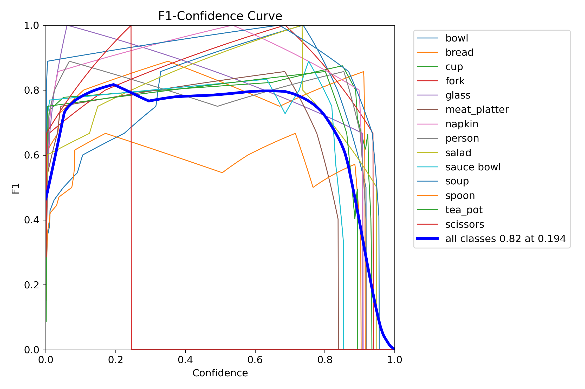
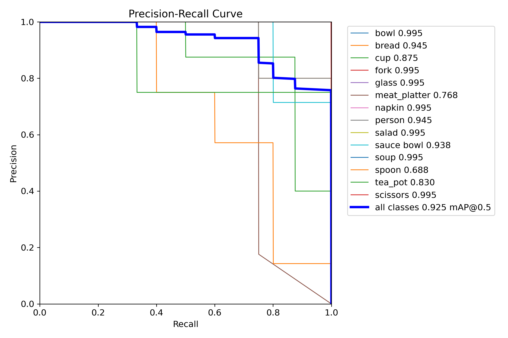
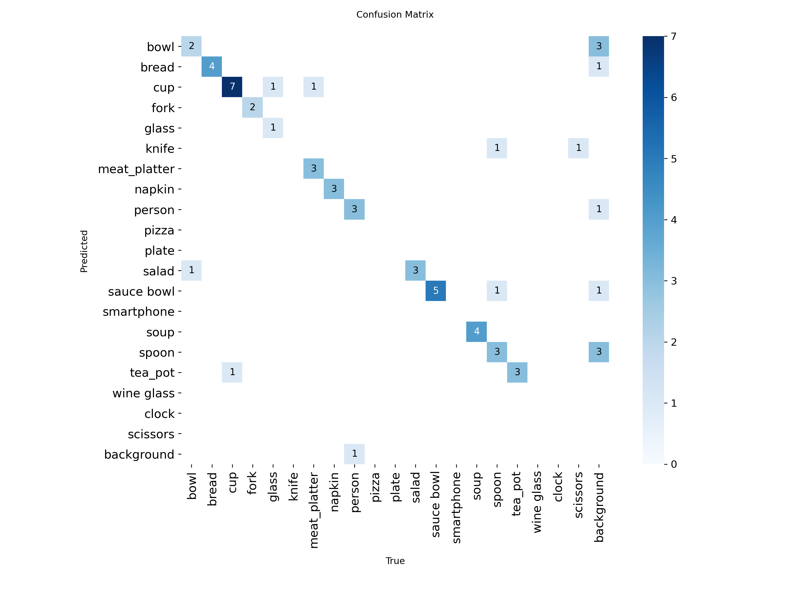
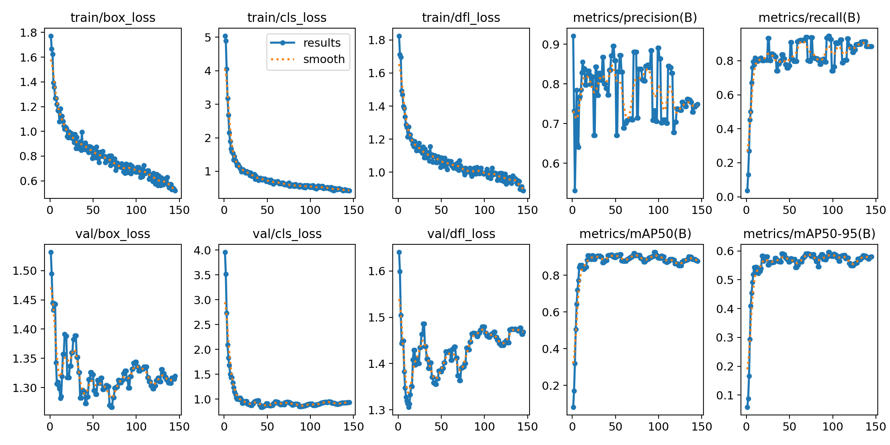
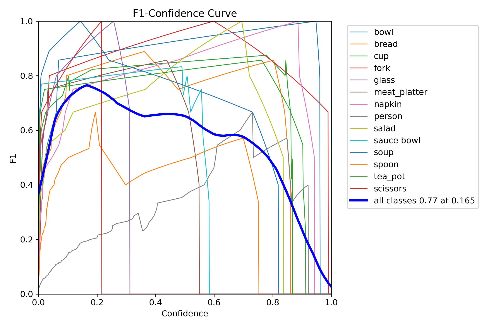
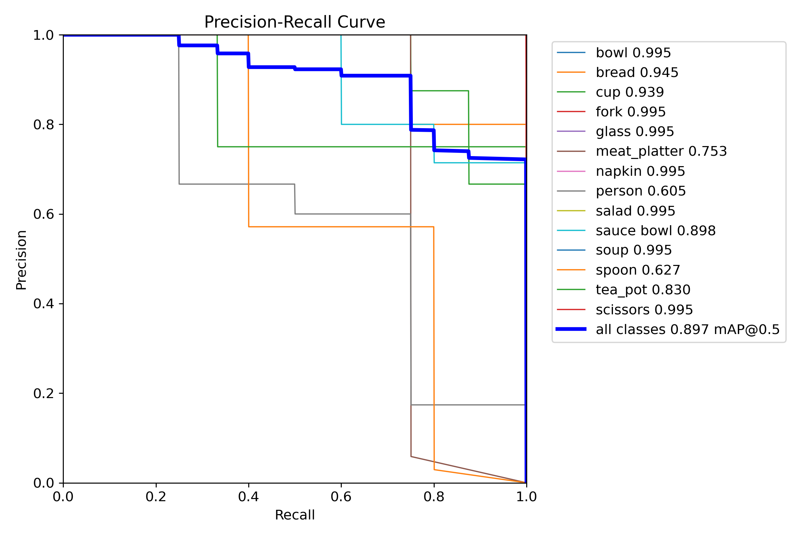
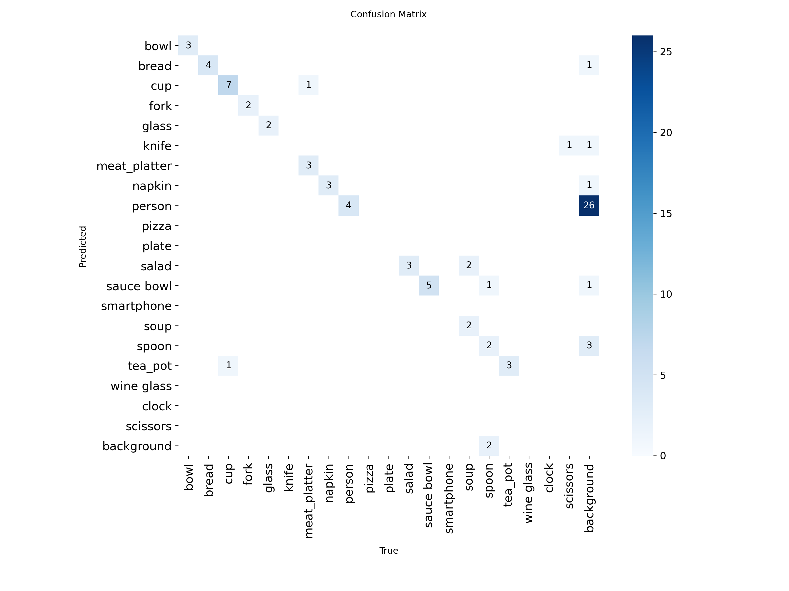
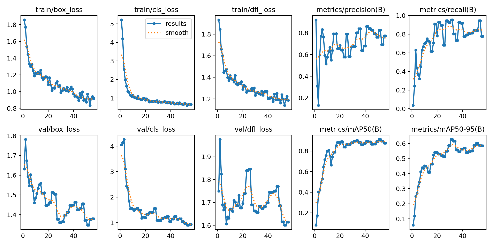

# Final Report

## Approach to Assignment & Hours Logged

### Implementation Concept: 2h 
My pragmatic approach to solving this task is utilizing a 
pretrained Yolo11s to achieve fast baseline annotation.

All annotated video frames are then imported into label-studio and then only key frames where visible changes are happening to the scene are manually corrected and labeled.

This approach provides clean training data which is critical for the success of any ML - approach although with the downside of less training data overall.

This smaller manually labeled dataset together with a slow learning rate and a larger number of epochs for fine-tuning should be able to achieve good results.

### Preprocessing & Labeling: 2h Preprocessing & 2h Manual Labeling
- Video frames are extracted to .jpg images via OpenCV for image annotation
- YOLO11s pre-trained on the COCO dataset is used for initial annotation of video frames
- After initial annotation, images and labels are saved into a directory for further manual enhancement using
  Label Studio, including import.json for easier importing into Label Studio
- Images and labels are imported into Label Studio and manually corrected/enhanced
- Only about 50 key frames where the video is rapidly changing were manually corrected/labeled

### Fine-Tuning & Hyperparameter Optimization: 3h
- Label Studio results are extracted, formatted into a directory, and split into train/test/val
- dataset.yaml is also created as a reference to the dataset for fine-tuning purposes
- The following parameters were manually selected for fine-tuning and augmentation:
```
epochs=150,
plots=True,
imgsz=1280,
device="cuda",
batch=8,
lr0=0.001,
mosaic=1.0,
mixup=0.1,
degrees=2,
translate=0.02,
scale=0.1,
fliplr=0.0,
hsv_v=0.2,
hsv_h=0.0,
hsv_s=0.1,
patience=50
```
- `1280 image size` is used to maintain the high quality details of 4k source images

- `epochs=150, lr=0.001, patience=50` - conservative learning rate for fine-tuning on a smaller dataset for a larger amount of epochs

- The `mosaic=1.0,
mixup=0.1,
degrees=2,
translate=0.02,
scale=0.1,
fliplr=0.0,
hsv_v=0.2,
hsv_h=0.0,
hsv_s=0.1` 
parameters are used for dataset augmentation
  - The augmentation strategy mainly focuses on mosaic augmentations to increase diversity for this smaller dataset
  - The rest of the augmentation provides small geometric, brightness and saturation changes to the dataset

- For hyperparam optimization as according to the task description 1-2 iterations did not manage to provide acceptable performance and overfitted to the validation set

- For experimental purposes, I also explored up to 30 iterations to see if performance would catch up to my manual configuration
- The following search space was used:
```
'lr0': (0.0007, 0.0015),
'lrf': (0.01, 0.03),
'momentum': (0.92, 0.95),
'weight_decay': (0.0003, 0.0007),
'warmup_epochs': (2, 4),
'box': (7.0, 8.0),
'cls': (0.45, 0.55),
'dfl': (1.4, 1.6),
'mixup': (0.08, 0.12),
'degrees': (1, 3),
'translate': (0.015, 0.025),
'scale': (0.08, 0.12),
'hsv_v': (0.15, 0.25),
'hsv_s': (0.08, 0.12),
'mosaic': (1.0, 1.0),
'fliplr': (0.0, 0.0),
'hsv_h': (0.0, 0.0)
```
- and the following combination of hyperparams was deemed as the best according to the search:
```
lr0: 0.0015
lrf: 0.01
momentum: 0.92
weight_decay: 0.00054
warmup_epochs: 2.97198
box: 8.0
cls: 0.51254
dfl: 1.6
mixup: 0.08
degrees: 1.0
translate: 0.02382
scale: 0.12
hsv_v: 0.22092
hsv_s: 0.11943
mosaic: 1.0
fliplr: 0.0
hsv_h: 0.0
```

## Results - Written Report 1.5h

### Manually Fine-Tuned YOLO11s Model



The F1 confidence curve shows that the models balances precision and recall well with a score of 0.82
at the confidence of 0.194. This implies that the model still manages to perform well in situations of low prediction confidence



The precision recall curve shows a mAP@0.5 of 0.925 which is impressive. Most categories perform nearly perfectly meanwhile 
meat platter seems to struggle a bit more maybe due to its more complex inherent appearance



The confusion matrix indicates solid classification performance with a mostly diagonal patterns 
and most classification errors happening when identifying small tableware and most of them occur only once during validation.



The training metrics in the plot show stable convergence without overfitting with 
loss going constantly down and validation metrics plateauing at high values.


Here's also a snapshot of performance on the validation set showing good stable performance. 
Tableware detection is consistent at 0.8–0.9 confidence, meanwhile person detection shows
slightly worse performance with a wider confidence range 0.5–0.9.

This model handels complex overlapping objects with more stable performance 
when compared to the hyperparameter optimized model.

### Hyperparameter Optimized YOLO11s Model



The model peaks at F1 score of 0.77, which is lower than the previous model's 0.82. 
The person class (gray line) barely achieves above 0.4 F1 score at any confidence level,
showing poor performance in comparison to the manually selected hyperparameters.



Overall mAP is solid at 0.897, with most tableware items achieving great performance (0.99+ AP). 
However, the person class shows only 0.605 AP, indicating the hyperparameter optimization traded 
person detection accuracy for improved tableware performance.



The confusion matrix shows minimal cross-class confusion, indicating accurate classification 
when objects are detected. The primary issue is again missed detections 
rather than misclassification, particularly affecting again person detection



The training metrics in this scenario also show very stable performance and convergence during training
indicating a successful optimization process.


Tableware items are detected with high confidence scores (0.8-0.9), while people receive lower confidence scores or may be missed entirely.
This aligns with the poor person detection performance observed in real-world video testing.

### Conclusion

#### Model Comparison
Both models managed to achieve on paper very impressive performance. 
The hyperparameter optimized model aims to improve performance across all classes based on metrics, 
hence it made the decision to trade off detection performance for the person class in exchange for better performance in other classes.

The manually fine-tuned model shows better generalization across all classes that leads to better 
real world performance as can be seen in the result videos. My analysis leads to the conclusion that the manually tuned 
model offers better general performance and when applied to a real-world scenario such it definitely makes a noticeable 
difference.

P.S: Hyperparameter optimization at 1-2 iterations showed a complete lack of performance hence up to 30 iterations were explored
since I was interested in comparing performance. This is a drawback of having a higher quality smaller dataset since that leads
to an even smaller validation set leading to bad performance at a low amount of explorative iterations.

#### YOLO
- YOLO Ultralytics has a pretty low-code approach - for example, augmentation & fine-tuning in a single method when compared to PyTorch
- YOLO likes to utilize straight file paths and YAML config files for dataset definition/loading - this could be problematic
in production environments; hence a more streamlined workflow (using some platform like Roboflow) should be implemented 
if this solution were to be deployed at a larger scale
- I personally don't have a lot of experience with YOLO as I have recently mostly worked with ResNets and VGGs using PyTorch, 
but it wasn't that much trouble going through the documentation and catching up to speed on how YOLO works.

#### Total hours spent on assignment = 10.5 ~ 11 hrs across 4 days